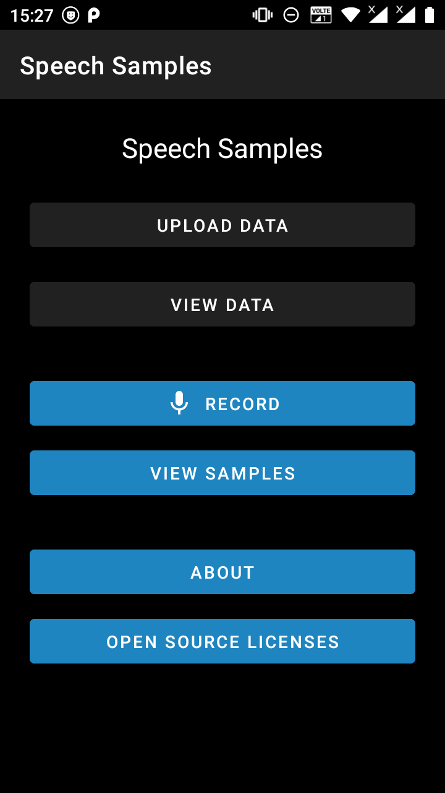
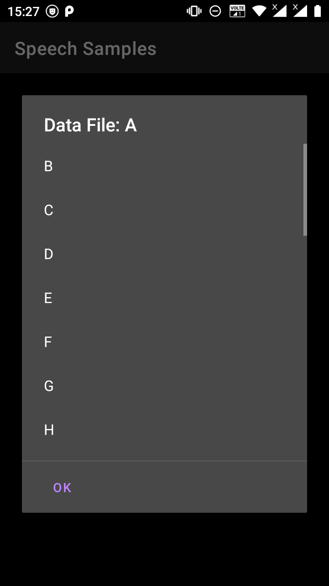

# Voice Sample Collector
# NOTE: In Development(not ready for use).
Voice sample collector app created for collection of audio samples for research and other purposes.

## Screenshots

# How to use App?
- Firstly create a Text (.TXT) file to upload into the App for Text, Words, Sentence or Numerals etc. consisting an Header as bellow:  
  Marathi Consonants (<b>Note that this is a Header and text-corpus/corpora should be started from second line</b>) 
  Ka 
  Kha 
  Ga 
  Gha 
  ...
 
 - After uploading Text (.TXT) file, you can view the contents of uploaded file by tapping VIEW DATA button available.
 - 
  
