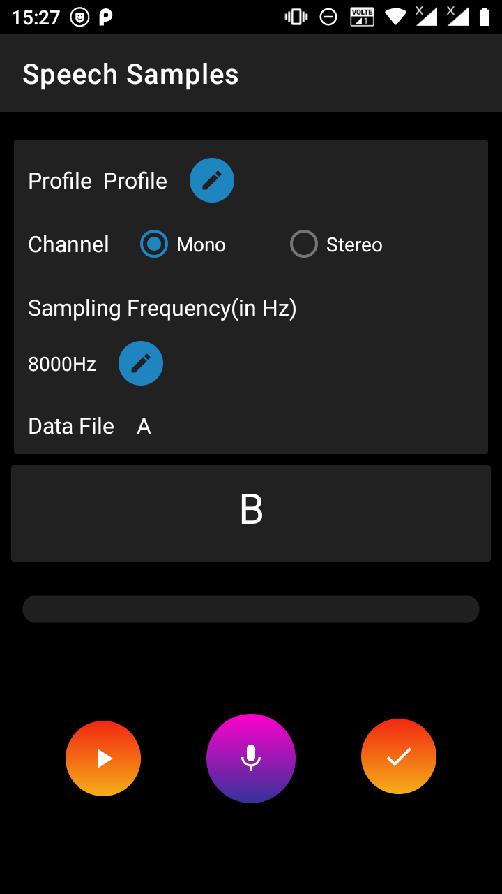

# Voice Sample Collector
# NOTE: In Development(not ready for use).
Voice sample collector app created for collection of audio samples for research and other purposes.


## Screenshots

&nbsp;
&nbsp;
&nbsp;
&nbsp;


# How to use App?
- Create a data file(.txt file)
    with Format:<br>
    ```
    TITLE
    data_1
    data_2
    data_3
    data_n
    ```
    
    Ex. For recording Alphabet samples
    ```
    Alphabets
    A
    B
    C
    ```
    Notice that first line is title and will be used as name of 
    folder where all samples will be saved for that data file.
    
    
 - After uploading Text (.TXT) file, you can view the contents of uploaded file by tapping VIEW DATA button available.
 - Then, you can tap on RECORD button to launch recording screen to collect speech samples.
 - On Record screen, edit a profile name (name of user who is giving speech samples) by tapping EDIT button available next to Profile Label.
 - You can select Channel as Mono or Stereo as per your need.
 - You can select Sampling Frequencies from the Drop-Down list available after taping Edit button next to Sampling Frequency (in Hz)
 - Record the Text, word, sentence, or numeral shown on the Label below the Data File by tap & Hold Record (MIC) button, when you release it, the recorded file then stored in your App location, you can playback it by tapping Play icon/button available at bottom left side of screen.
 - If you (Research Student) thinks, the recorded sample is enough good then you can mark it for save and move for next text, word, sentence, or numeral by tapping OK (tick) icon/button available right side to Record icon/button. 
 - All data is saved inside <b>(Android/media/in.foreplus.voicesample/DATA_FILE_NAME/PROFILE_NAME/)</b>
